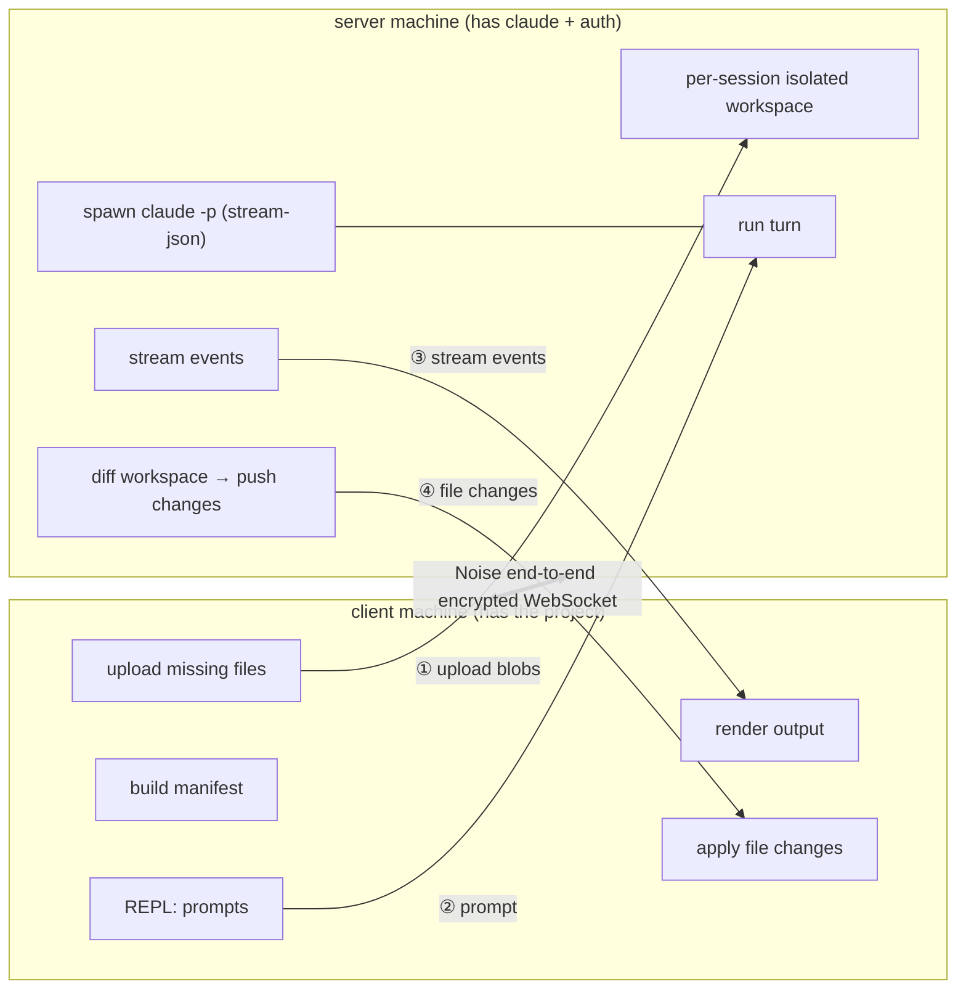
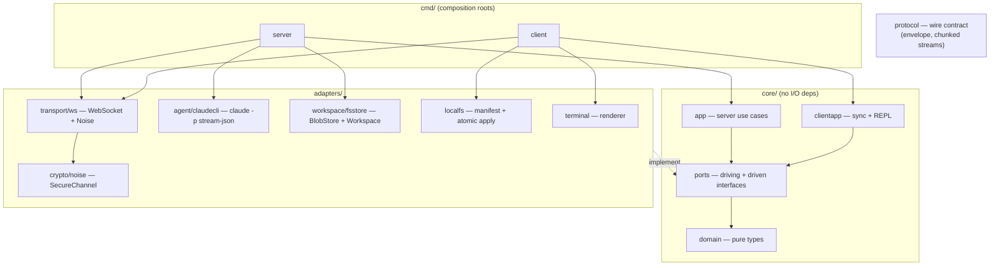

<p align="center">
  
</p>

<h1 align="center">claude-share</h1>

<p align="center">
  <a href="https://dmux.github.io/claude-share/"><b>Website</b></a> ·
  <a href="https://github.com/dmux/claude-share/releases/latest"><b>Releases</b></a> ·
  <a href="CHANGELOG.md"><b>Changelog</b></a>
</p>

Share **one machine's authenticated Claude Code installation** with other
developers on an **internal network**, over an **end-to-end encrypted**
WebSocket channel. Each developer works against **their own local project
directory**; the shared server runs Claude and syncs the results back.

- **Server**: has `claude` installed and logged in (Max subscription or API key).
- **Client**: has the project files locally, no Claude install/login required.



## How it works

1. The client builds a manifest (SHA-256 per file, honoring `.gitignore`) and
   uploads only the files the server's content-addressed store is missing.
2. The server materializes an isolated workspace per session and starts one
   `claude` subprocess (`--permission-mode acceptEdits`), rooted at that
   workspace, kept alive for the whole multi-turn conversation.
3. Each prompt runs a turn: assistant output streams back live; when the turn
   ends, the server diffs the workspace and pushes created/modified/deleted
   files, which the client applies atomically to the local project.

The "shared instance" is the server's Claude binary + credentials. Each client
gets its own workspace and its own subprocess — a single conversation is never
multiplexed between clients.

## Security model

### End-to-end encryption

The channel uses the [Noise Protocol Framework](https://noiseprotocol.org),
pattern `Noise_NNpsk0_25519_ChaChaPoly_BLAKE2s`:

- Ephemeral X25519 keys on both sides → **forward secrecy**.
- A pre-shared key derived from your shared token (`HKDF-BLAKE2s`) is mixed in at
  position 0 → **mutual authentication**. A peer without the token cannot
  complete the handshake, so a passive or active man-in-the-middle is rejected.
- All application data is ChaCha20-Poly1305 AEAD; a single tampered byte fails
  decryption and drops the connection.

**Honest scope of "end-to-end":** because Claude runs *on the server* and must
read and write the project files, the server is a legitimate endpoint that
necessarily handles plaintext. This channel secures the wire between the two real
endpoints (client and server); it is **not** a design where the server is blind.
If you would not trust the server operator with your source code, do not use it.

### Internal-network posture

- The server **refuses to bind a wildcard (`0.0.0.0`, `::`) or non-loopback
  address unless you pass `--allow-public`**. Default is loopback only.
- Run it on a trusted LAN or over a VPN (e.g. WireGuard/Tailscale). **Never
  port-forward it to the public internet.**
- Path-traversal is blocked on every file operation; uploaded blob content is
  verified against its claimed hash; file/total size guards bound resource use;
  `--max-sessions` bounds concurrency.

TLS is not required (Noise already provides confidentiality, integrity,
authentication, and forward secrecy) but you may layer it via a reverse proxy.

## Build

```sh
make build       # produces bin/claude-share-server and bin/claude-share-client
make test        # runs the test suite
make vet
```

Requires Go 1.25+. The server machine needs `claude` on its `PATH`, already
authenticated (`claude` once interactively, or `ANTHROPIC_API_KEY`).

## Run

The channel is authenticated by a shared secret (`CLAUDE_SHARE_TOKEN`) that must
match on **both** ends. If you don't set one on the server, it generates a
strong, Bitwarden-style passphrase for you and prints it at startup — copy that
value to each client. Set the env var yourself instead when you need a
reproducible or scripted secret.

**Server** (on the machine with Claude):

```sh
# Bind to a LAN address so clients can reach it (internal network only).
# With no CLAUDE_SHARE_TOKEN set, the server prints a generated share token:
bin/claude-share-server --addr 192.168.1.50:8443 --allow-public
#   → [claude-share] no CLAUDE_SHARE_TOKEN set — generated a share token for this run:
#   →     radiance-scoreless-attentive-finishing-putdown-immovable

# Or set your own secret explicitly (must match every client):
export CLAUDE_SHARE_TOKEN='choose-a-strong-secret'
bin/claude-share-server --addr 192.168.1.50:8443 --allow-public
```

**Client** (on each developer's machine, from any project directory):

```sh
export CLAUDE_SHARE_TOKEN='the-token-the-server-printed'   # must match the server
bin/claude-share-client --server ws://192.168.1.50:8443/ws --dir .
```

Then type prompts at the `>` REPL. Files Claude changes appear in your local
directory, prefixed `+` (create), `~` (modify), `-` (delete). Ctrl-D ends the
session.

### Key flags

| Server | Default | Meaning |
|---|---|---|
| `--addr` | `127.0.0.1:8443` | listen address |
| `--allow-public` | `false` | required to bind a non-loopback/wildcard address |
| `--data-dir` | `~/.claude-share` | blob store + session workspaces |
| `--permission-mode` | `acceptEdits` | passed to `claude` |
| `--max-sessions` | `8` | concurrent session cap (0 = unlimited) |
| `--claude-bin` | `claude` | path to the claude executable |
| `--version` | — | print version and exit |

| Client | Default | Meaning |
|---|---|---|
| `--server` | `ws://127.0.0.1:8443/ws` | server URL |
| `--dir` | `.` | local project to share |
| `--name` | dir name | project name |
| `--max-file-size` | 25 MiB | reject larger files |
| `--max-total-size` | 500 MiB | reject larger projects |
| `--version` | — | print version and exit |

Add a `.claudeshareignore` (same syntax as `.gitignore`) to exclude extra paths.

## Architecture (hexagonal)

Dependencies point inward; the core knows nothing about WebSocket, `os/exec`, the
filesystem, or Noise — all behind ports.



Dependencies point inward: adapters implement the ports; `core` never imports an
adapter.

## Limitations

- **`acceptEdits`**: edits/commands are auto-accepted server-side; you review the
  diffs the client applies. Forwarding permission prompts to the client (via an
  MCP `--permission-prompt-tool`) is future work.
- **Interrupt** is best-effort only; headless stream-json has no clean mid-turn
  cancel.
- **Concurrent local edits** during a live turn are not merged — the server
  workspace is authoritative for that turn.
- A future evolution (Option B) would proxy Claude's tools directly onto the
  client's real filesystem (no sync); the ports already isolate the pieces that
  would change.

```
